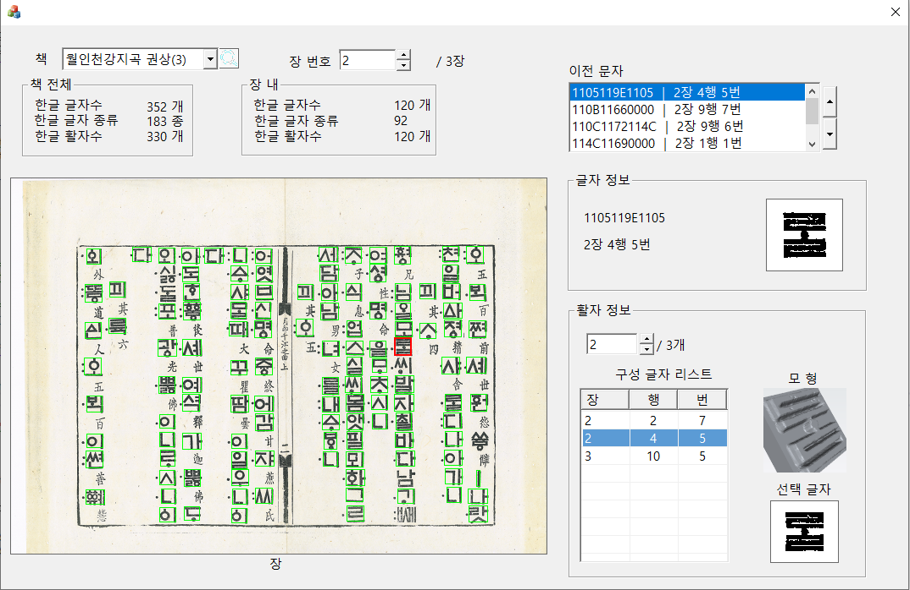

# 📚 Ancient-Type-DB  
**고활자 정보 관리 및 시각화 시스템**

고문헌(예: *월인천강지곡*)의 스캔 이미지에서 추출된 활자 정보를  
체계적으로 관리하고 시각화하기 위한 **MFC 기반 데스크톱 애플리케이션**입니다.

---

## 📌 목차

1. 프로젝트 소개  
2. 주요 기능  
3. 실행 화면 예시  
4. 기술 스택  
5. 프로젝트 구조  
6. 설치 및 빌드 방법  
7. 데이터 구성  
8. 라이선스  

---

## 1️⃣ 프로젝트 소개

**Ancient-Type-DB**는 고문헌 스캔 이미지와 그 안에 포함된 개별 활자 정보를  
CSV 데이터베이스 및 3D 모델과 연계하여 관리·분석할 수 있도록 설계된 프로그램입니다.

- 스캔 이미지 기반 활자 위치 시각화  
- 개별 활자 이미지 및 3D 모델 확인  
- 고활자 데이터의 체계적인 관리  

---

## 2️⃣ 주요 기능

### 📌 1. 스캔 이미지 기반 활자 시각화
- 대용량 고문헌 스캔 이미지 로드
- CSV 데이터 기반 활자 좌표 표시
- 선택한 활자의 위치를 박스로 강조 표시

### 📌 2. 개별 활자 정보 조회
- 선택된 활자의 이미지 출력
- 유니코드 및 메타데이터 표시
- 활자별 데이터 탐색 가능

### 📌 3. 3D 활자 모델 뷰어 (VTK)
- STL 형식의 3D 활자 모델 로드
- 마우스 기반 회전 / 확대 / 축소
- Phong Shading 기반 3D 렌더링

### 📌 4. 데이터베이스 관리
- `typeDB.csv` 기반 활자 데이터 관리
- 대량 데이터 처리에 최적화
- 장·행·번호 기반 구조적 접근 가능

---

## 3️⃣ 실행 화면 예시




---

## 4️⃣ 기술 스택

| 구분 | 기술 |
|------|------|
| 프로그래밍 언어 | C++ |
| UI 프레임워크 | MFC (Microsoft Foundation Classes) |
| 3D 시각화 | VTK (Visualization Toolkit) |
| 개발 환경 | Visual Studio |
| 버전 관리 | Git / GitHub |

---

## 5️⃣ 프로젝트 구조

```plaintext
Ancient-Type-DB/
├─ 01_scan/          # 원본 스캔 이미지
├─ 03_type/          # 추출된 활자 이미지
├─ 04_3d/            # 3D STL 모델 파일
├─ picture/          # README 및 UI 예시 이미지
├─ typeDB.csv        # 활자 정보 데이터베이스
├─ TermProject.sln   # Visual Studio 솔루션 파일
├─ README.md
└─ .gitignore
```

---

## 6️⃣ 설치 및 빌드 방법

### 🔧 필수 환경
- Windows OS
- Visual Studio
- VTK 라이브러리 (빌드 버전 일치 필수)

### 🛠 빌드 절차
1. Visual Studio에서 `TermProject.sln` 열기  
2. VTK Include / Library 경로 설정  

```plaintext
프로젝트 속성 → VC++ 디렉터리

Include Directories:
C:\VTK\include

Library Directories:
C:\VTK\lib
```

3. 링커 입력(Input)에 VTK 관련 `.lib` 파일 추가  
4. 실행 파일과 동일한 위치에 VTK `.dll` 파일 배치  

---

## 7️⃣ 데이터 구성

### 📄 typeDB.csv 구조 예시

| 필드명 | 설명 |
|------|------|
| Unicode | 활자 유니코드 |
| x, y | 스캔 이미지 상 좌표 |
| w, h | 활자 영역 크기 |
| Page / Line / Index | 문헌 내 구조 정보 |

CSV 데이터는 프로그램 실행 시 자동으로 로드되어  
이미지 및 3D 모델과 연동됩니다.

---

## 👨‍💻 개발자

- 김도윤, 김동언, 김도현
- GitHub: https://github.com/Doyun2003
